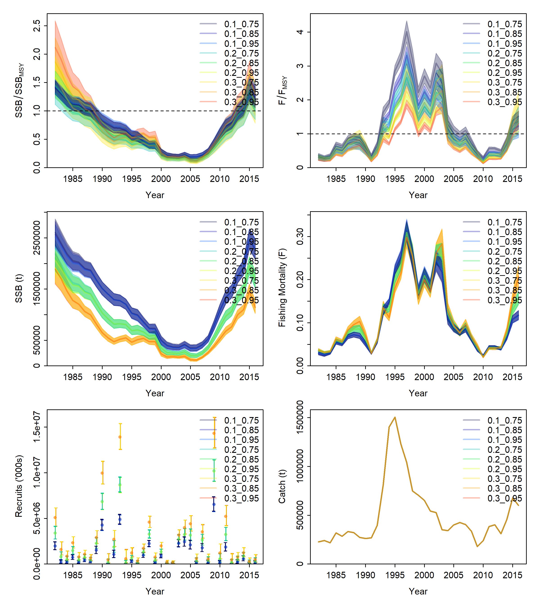
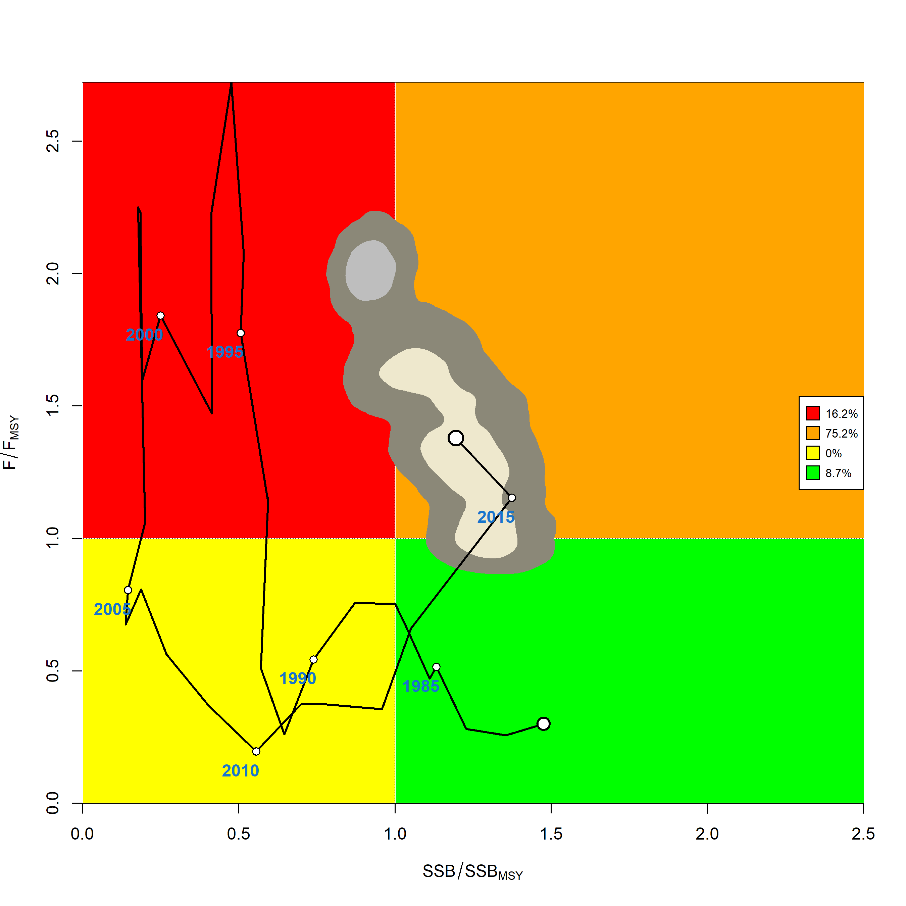

```{r setup, include = FALSE}
  knitr::opts_chunk$set(eval = FALSE)
```

In this example we will set up and run a simple job array of Stock Synthesis models on OSG and show how results can be combined in a model ensemble.
We assume that you have already set-up your OSG environment to work with *ssgrid*.
If not, please check out [this guide](https://n-ducharmebarth-noaa.github.io/ssgrid/articles/a_setup_osg.html).
Here we use example Stock Synthesis input files^[Simulated data loosely based on Pacific Hake.] that are distributed with *ssgrid* but these can be substituted for any Stock Synthesis files read in using [*r4ss*](https://github.com/r4ss/r4ss).

The first step is to load *ssgrid*. We will also use both [*r4ss*](https://github.com/r4ss/r4ss) and [*ss3diags*](https://github.com/PIFSCstockassessments/ss3diags) but will reference those functions directly.

```{r}
  library(ssgrid)
```

The Stock Synthesis input files:

- `ss_control`
- `ss_data`
- `ss_starter`
- `ss_forecast`

are automatically available upon loading the *ssgrid* package.

We also need to define the directory where we are going to build the files needed to run our job array.

```{r}
  array_directory = paste0(getwd(),"/example/ensemble/")
  # check if directory exists, otherwise create it
  if(!file.exists(array_directory)){
    dir.create(array_directory)
  }
```

Here I create a directory within my default working directory but you can change/name this to anything you want.
This is where the Stock Synthesis files will get written into, and where results from OSG will get downloaded.  

The next step is set up the different model configurations to investigate as a part of our model ensemble or job array.
In this simple example, we are assume that natural mortality (*M*) and steepness (*h*) are fixed but there is uncertainty regarding the assumed values.
Let us consider three alternative hypotheses for each value and a full-factorial ensemble of possible combinations:

```{r}
  testing_options = expand.grid(M=c(0.1,0.2,0.3),
                                h=c(0.75,0.85,0.95))
```

Now we can write the Stock Synthesis files into sub-directories of `array_directory`,
making sure to modify the control file to have the appropriate settings for *M* and *h*.

```{r}
  for(i in 1:nrow(testing_options))
  {
    # create sub-directory
      tmp_name = paste0(testing_options[i,],collapse = "_")
      tmp_dir = paste0(array_directory,tmp_name,"/")
      dir.create(tmp_dir,recursive = TRUE)
    # modify input file - M
      tmp_ctl = ss_control
      pointer = grep("NatM_p_1_Fem_GP_1",rownames(tmp_ctl$MG_parms),fixed=TRUE)
			tmp_M = testing_options$M[i]
			tmp_ctl$MG_parms$LO[pointer] = tmp_M - 0.1*tmp_M
			tmp_ctl$MG_parms$HI[pointer] = tmp_M + 0.1*tmp_M
			tmp_ctl$MG_parms$INIT[pointer] = tmp_M
			tmp_ctl$MG_parms$PRIOR[pointer] = tmp_ctl$MG_parms$INIT[pointer]
    # modify input file - h
    	pointer = grep("SR_BH_flat_steep",rownames(tmp_ctl$SR_parms),fixed=TRUE)
			tmp_h = testing_options$h[i]
			tmp_ctl$SR_parms$LO[pointer] = 0.2
			tmp_ctl$SR_parms$HI[pointer] = 0.999
			tmp_ctl$SR_parms$INIT[pointer] = tmp_h
			tmp_ctl$SR_parms$PRIOR[pointer] = tmp_ctl$SR_parms$INIT[pointer]
    # write input files
      r4ss::SS_writectl(ctllist = tmp_ctl, outfile = paste0(tmp_dir,"control.ss"))
      r4ss::SS_writedat(datlist = ss_data, outfile = paste0(tmp_dir,"data.ss"))
      r4ss::SS_writeforecast(mylist = ss_forecast, dir = tmp_dir)
      r4ss::SS_writestarter(mylist = ss_starter, dir = tmp_dir)
    # clean-up
      rm(list=c("tmp_name","tmp_dir","tmp_ctl","pointer","tmp_M","tmp_h"))
  }
```

Now that all the input files are created we can upload the directories to OSG, set up the job array, and run the job!
When modifying this code for your purposes, make sure to request enough memory and disk space in `osg_condor_submit_create()`.
```{r}
  # open a connection to OSG via ssh
  	osg_session = osg_connect(unix_name = "your.username", login_node = "login05.osgconnect.net")
  
  # upload the directory
	  osg_upload_ss_dir(session = osg_session,
					unix_name = "your.username",
					login_node = "login05.osgconnect.net",
					local_dir_path = array_directory,
					local_dir_names = list.dirs(array_directory,full.names=FALSE,recursive=FALSE),
					remote_dir_path = "example/ensemble/",
					files_to_upload = c("control.ss","data.ss","forecast.ss","starter.ss"),
					target_dir_path = "target_dir_files/",
					target_dir_txt_name = "target_dir.txt")
  
  # define job executable to run a Stock Synthesis model for each model defined by testing_options
	  osg_wrapper_create(session=osg_session,
					unix_name = "your.username",
					login_node = "login05.osgconnect.net",
					wrapper_actions = c("00_run_ss"))

  # create condor_submit script
	  osg_condor_submit_create(session=osg_session,
					unix_name = "your.username",
					login_node = "login05.osgconnect.net",
					c_memory="600MB",
					c_disk="600MB",
					c_input_files=c("Start.tar.gz","ss_linux"),
					c_project="osg.your_project",
					c_target_dir_path="target_dir_files/target_dir.txt",
					c_singularity="r:4.0.2",
					overwrite = TRUE,
					verbose = TRUE)

  # copy Stock Synthesis executable into each directory on OSG
	  osg_multi_copy(session=osg_session,
					unix_name = "your.username",
					login_node = "login05.osgconnect.net",
					remote_source_path = c("ss_executable/3.30.16.00_safe/"),
					files_to_copy = c("ss_linux"),
					remote_paste_path = paste0("example/ensemble/",list.dirs(array_directory,full.names=FALSE,recursive=FALSE),"/"))

  # launch the job!
	  osg_execute(session=osg_session,
					unix_name = "your.username",
					login_node = "login05.osgconnect.net")
```

Success! All nine models will now be run simultaneously using OSG's HTcondor high-throughput computing network.
It may take a minute or so (depending on the requirements listed in `osg_condor_submit_create()`) for your jobs to make it to the front of the queue.
However, all jobs should be finished running in a few minutes since this example uses a simple model.
You can monitor the status of your job using `osg_monitor()` which is just a wrapper around [condor_q](https://htcondor.readthedocs.io/en/latest/man-pages/condor_q.html) if you are directly logged into OSG via the terminal.

Once the jobs finish running, you can go ahead and download the results using `osg_download()`, and then close the connection to OSG.
Here we will download the model results, compressed as `End.tar.gz`.
We will also specify that we want to un-tar the results after downloading. 
```{r}
	osg_download_ss_dir(session = osg_session,
		      unix_name = "your.username",
					login_node = "login05.osgconnect.net",
					remote_dir_stem="example/ensemble/",
					remote_dirs=list.dirs(array_directory,full.names=FALSE,recursive=FALSE),
					download_dir_stem=array_directory,
					files_to_download=c("End.tar.gz"),
					untar_local=TRUE,
					clean_remote=FALSE,
					delete_remote=FALSE,
					verbose=TRUE)
  
  ssh::ssh_disconnect(osg_session)
```

Now that our models our downloaded, we can use existing functionality in the [*r4ss*](https://github.com/r4ss/r4ss) and [*ss3diags*](https://github.com/PIFSCstockassessments/ss3diags) packages to extract the results and combine them to form a model ensemble.

```{r}
  # get the results
  	tmp_models = r4ss::SSgetoutput(dirvec= paste0(array_directory,list.dirs(array_directory,full.names=FALSE,recursive=FALSE),"/"))
	  names(tmp_models) = list.dirs(array_directory,full.names=FALSE,recursive=FALSE)

  # use ss3diags::SSdeltaMVLN() to generate uncertainty using the estimated variance-covariance matrix in a Monte Carlo simulation
  # We generate 10,000 samples per model and assume each has equal weight in the ensemble.
    set.seed(123)
    mvn_samples.list = as.list(rep(NA,length(tmp_models)))
    for(i in seq_along(tmp_models))
    {
      mvn_samples.list[[i]] = SSdeltaMVLN(tmp_models[[i]],mc=10000,weight = 1, run = names(tmp_models)[i], plot = FALSE)$kb
    }

  # combine samples across models
    mvn_samples = do.call("rbind", mvn_samples.list)
```  

Plot the individual model results.
```{r}
	png(file = paste0(array_directory,"MVLN_Trjs.png"), width = 8, height = 9, res = 300, units = "in")
	  r4ss::sspar(mfrow=c(3,2),plot.cex = 0.8)
	  ss3diags::SSplotEnsemble(mvn_samples, add =TRUE)
	dev.off()
``` 

{#id .class width=50% height=50%}

Plot the combined ensemble results.
```{r}
	png(file = paste0(array_directory, "/kobe_kernel",".png"), width = 9, height = 9, res = 300, units = "in")
	  ss3diags::SSplotKobe(mvn_samples,posterior = "kernel") # show CIs with 2d-Kernel
	dev.off()
``` 

{#id .class width=50% height=50%}

Additionally, as a part of the job executable defined by `osg_wrapper_create()`, all jobs get returned with a text file `runtime.txt`.
This gives the actual execution time of the job in seconds, excluding file transfer and waiting in the queue.
We can extract this value for each model and sum across models to see how long it actually took to run our nine example models on OSG.

```{r}
  runtime_vec = rep(NA,nrow(testing_options))
  for(i in seq_along(runtime_vec))
  {
    runtime_vec[i] = scan(paste0(array_directory,list.dirs(array_directory,full.names=FALSE,recursive=FALSE)[i],"/runtime.txt"))
  }
  avg_runtime_m = mean(runtime_vec)/60
  total_runtime_m = sum(runtime_vec)/60
```

In this simple example each model took just over a minute to run, with a little over nine minutes of total runtime.